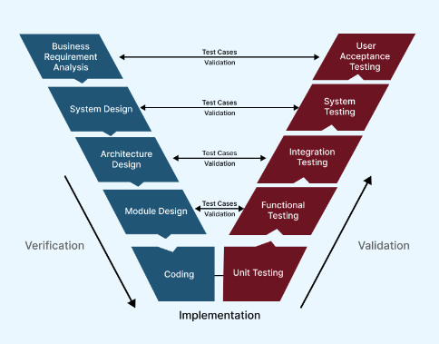
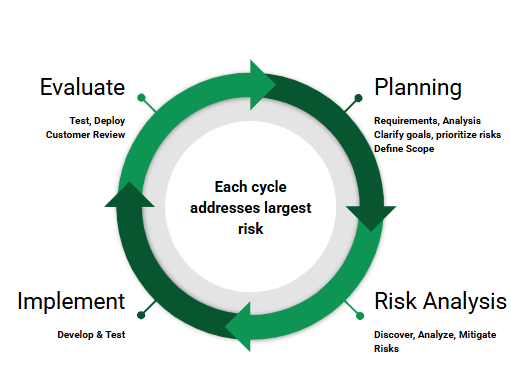

# SDLC Compare & Contrast

**Column Definitions**

* **Name** — The phase's name as used within this specific SDLC.  
* **Goal** — What this phase is trying to produce or accomplish; the target state, not the method.  
* **Guiding Principle** — The behavioral rule or decision-making stance that governs how work gets done during this phase.  
* **Correlations** — How this phase maps to the fundamental phases. There can be a 1:1 match, a blurring across multiple phases, or a combination of multiple phases.  
* **Techniques** — The concrete practices, artifacts, or methods used to do this phase's work. Techniques are how a team does something (e.g. TDD, Planning Poker), or a specific type of something (e.g. User Stories, Story Points). Avoid generic activity (e.g. Coding). The idea is that a technique provides some distinction or instructional insight.

**Fundamental phases**

Every Software Engineering project has these fundamental phases: 

1. **Requirements**: What does the customer want?  
2. **Analysis**: What am I allowed to use to get it done? Can I get it done?   
3. **Design**: What will I use? How is it structured and organized?  
4. **Implementation**: Get it done  
5. **Test**: Did I satisfy the customer's requests? Does it work?   
6. **Deploy**: Give it to the customers (safely)  
7. **Maintain**: Patch and augment the functionality (may need more phases to decide what/how to augment)

## Waterfall

| Name | Goal | Guiding Principle | Correlations | Techniques |
| ----- | ----- | ----- | ----- | ----- |
| **Requirements** | Capture a complete picture of what the customer wants before any other work begins. | Get it fully right the first time, since this phase will not be revisited later. | Requirements  | Stakeholder interviews; formal requirements documentation. |
| **Analysis** | Determine what resources, technology, and constraints are available, and confirm the project is feasible. | Audit feasibility thoroughly now, since discovering a constraint later is costly to correct. | Analysis | Feasibility studies; business logic and application modeling. |
| **Design** | Decide what will be used and how it will be structured, translating requirements and analysis into a technical blueprint. | Produce a complete, detailed specification before coding starts, since Design won't be revisited once Implementation begins. | Design | Design specification documents covering architecture, interfaces, and data sources. |
| **Implementation** | Write the source code based on the models and specifications produced in Design. | Follow the design specification faithfully rather than reinterpreting it during coding. | Implementation | Coding in smaller units, later integrated. |
| **Test** | Verify that the finished software satisfies requirements and works correctly before release. | Treat testing as a distinct, thorough gate; a failure can send work back to Implementation, but not further back to Design or Analysis. | Test | Formal test plans covering unit, integration, functional, and acceptance testing. |
| **Deploy** | Release the fully tested software into the live environment. | Confirm full functionality before release, since deployment is treated as a single event, not an incremental rollout. | Deploy | Installation and release as a single deliverable. |
| **Maintain** | Patch issues and extend functionality after the software is in live use. | Handle changes formally (corrective, adaptive, perfective), consistent with the model's documentation-heavy character. | Maintain | Patch releases and new versions addressing reported issues. |

### Notes 

In Correlations, every row is a 1:1 match with a Fundamental phase, with no blurring or combining anywhere. Waterfall's correlations column is boring by design.

## V-Shaped Model

| Name | Goal | Guiding Principles | Correlations  | Techniques |
| ----- | ----- | ----- | ----- | ----- |
| **Requirements Analysis** | Capture user needs and define acceptance criteria | Clarify expectations early and document precisely | Requirements. Test (Validation) | User requirements documents, acceptance test plans, use‑case modeling |
| **System Design** | Define the system’s high‑level structure | Ensure alignment with requirements and plan system‑level tests | Design. Test (Verification) | System design specifications, architecture overviews, system test planning |
| **Architectural Design (High‑Level Design)** | Specify module interactions and system architecture | Choose feasible architectures and prepare for integration testing | Design. Test (Verification) | Architecture diagrams, interface specifications, integration test case design |
| **Module Design (Low‑Level Design)** | Describe internal module logic in detail | Provide enough detail for coding and unit test planning | Design. Test (Verification) | UML class diagrams, module design specs, unit test case development |
| **Coding** | Implement modules according to design | Follow standards and maintain traceability to design | Implementation | Code reviews, static analysis tools, coding guidelines |
| **Unit Testing** | Verify each module works as designed | Test smallest components first to catch defects early | Test (Verification). Mirrors Module Design | Unit test suites, assertion libraries, automated test harnesses |
| **Integration Testing** | Verify modules interact correctly | Ensure module interactions behave as defined in architecture | Test (Verification). Mirrors Architectural Design | Integration test suites, API contract tests, interface testing tools |
| **System Testing** | Verify complete system behavior against system design | Ensure the system meets functional and non‑functional requirements | Test (Verification). Mirrors System Design | End‑to‑end test scripts, performance test plans, system test frameworks |
| **User Acceptance Testing (UAT)** | Validate the system meets user expectations | Confirm readiness for deployment and real‑world use | Test (Validation). Mirrors Requirements Analysis | UAT scripts, scenario‑based testing, production‑like environment testing |

### Notes

The V-Model is a verification and validation framework, focused on ensuring that requirements, design artifacts, implementation, and testing are tightly linked. The V-Model's main distinction is that test **planning** is embedded within the earlier phases rather than deferred until after implementation.

A common question about the V-Model diagram is why the descent on the left is labeled Verification and the ascent on the right Validation. Using the classic definitions, verification asks "*are we building the product right?*" and validation asks "*are we building the right product?*" Acceptance testing at the top of the V is clearly validation, since it checks the system against user needs. Whether the lower phases on the right also count as validation is murkier: unit and integration tests check against design specifications, which is verification, and system testing sits in a gray area. A more useful way to read the diagram is by activity rather than by side. On the way down, the team reviews and inspects requirements and design documents and **designs** the tests that will later be run against each level. On the way up, they **execute** those tests, which produces the evidence that each level conforms to its specification and, at the top, that the system meets user needs.

Another key insight is that **test planning happens early**. In the V‑Model, acceptance test plans are created during Requirements Analysis, system test plans during System Design, integration test plans during Architectural Design, and unit test plans during Module Design. This early planning reinforces the idea that quality is built into the process from the beginning rather than added at the end.

You can see that not every SDLC explicitly addresses every fundamental lifecycle concern. Some models focus on a subset of the lifecycle, leaving deployment and maintenance implied, external, or outside the model's primary scope.

  

## Spiral

| Name | Goal | Guiding Principles | Correlations  | Techniques |
| :---: | ----- | ----- | ----- | ----- |
| **Planning / Objective Setting** | Identify objectives, constraints, and requirements for the iteration | Clarify goals early, prioritize risks, define scope | Requirements \+ Analysis. Also known as Identify, Determine | Vision statements, stakeholder interviews, requirement prioritization matrices |
| **Risk Analysis** | Discover, analyze, and mitigate technical and project risks | Emphasize risk reduction, evaluate alternatives, prevent costly mistakes | Analysis. Also known as Risk Assessment, Identify Risks | Risk checklists, feasibility prototypes, decision trees, risk impact/probability charts |
| **Engineering / Development & Testing** | Build and verify the solution for this iteration | Develop incrementally, verify functionality, refine design | Implementation \+ Test (verification). Also known as Develop, Construct | Architectural modeling, interface mockups, unit test suites, integration test harnesses |
| **Evaluation / Customer Review** | Validate the iteration with stakeholders and plan the next cycle | Validate usefulness, gather feedback, decide next steps | Test (validation) \+ Deploy (internal). Also known as Evaluate, Review, Commit | User walkthroughs, usability testing scripts, feedback capture forms, iteration review reports |

### Notes

**Alternate Naming of Phases Across Sources**

Different authors and textbooks use different labels for the Spiral SDLC phases because the model is conceptual rather than prescriptive. Some emphasize objectives and identification, others emphasize design and construction, and some expand the cycle into five or six named steps to highlight planning or commitment activities. Despite the naming differences, these variants all describe the same underlying loop: define goals, analyze risks, build something, and evaluate it with stakeholders before moving to the next loop.

**The Spiral Model Is Risk‑Driven**

The Spiral SDLC is built around the idea that **risk determines what happens next**. Each loop begins by identifying the most significant technical, financial, usability, or schedule risks. The team then chooses the most effective way to reduce those risks, often through prototyping, simulation, experimentation, or alternative design exploration. Only after risks are reduced does the team commit to more expensive development work. This makes the Spiral model especially useful for large, complex, or high‑uncertainty projects.

**Product Release**

A key characteristic of the Spiral model is that **each revolution around the spiral does not produce a deployable product**. Instead, each loop increases the product’s completeness and functionality. Early loops may produce prototypes or partial implementations, while later loops refine architecture, add features, and stabilize the system. Only after the final iteration—when all planned loops have been completed and risks have been sufficiently reduced—is the fully developed product shipped to customers. In other words, the Spiral model delivers value incrementally but **releases only once**, at the end of the full spiral.

  

## Evolutionary Prototyping

| Name | Goal | Guiding Principles | Correlations  | Techniques |
| :---: | ----- | ----- | ----- | ----- |
| **Requirements Gathering and Analysis** | Identify the subset of requirements to explore in the next prototype cycle | Focus on uncertain or high‑value features; gather just enough detail to build | Requirements \+ Analysis | User stories, feature prioritization matrices, context diagrams |
| **Quick Design** | Create a simple, high‑level design for the prototype | Keep design lightweight; expect changes; emphasize clarity over completeness | Design | Wireframes, low‑fidelity UI sketches, simple architecture diagrams |
| **Build Prototype** | Construct a working model that demonstrates selected functionality | Build fast; aim for learning; accept imperfections | Implementation | Click‑through mockups, stubbed interfaces, rapid prototyping frameworks |
| **Initial User Evaluation** | Collect user feedback on the prototype’s behavior and usability | Encourage honest feedback; observe real interactions; validate assumptions | Test (validation) | Usability testing scripts, heuristic evaluation checklists, structured feedback forms |
| **Refine Prototype** | Improve the prototype based on user feedback | Iterate quickly; incorporate changes; reduce uncertainty | Design \+ Implementation | Iteration review notes, updated wireframes, revised interaction flows |
| **Final Product Development** | Convert the approved prototype into the full production system | Stabilize design; ensure quality; complete missing functionality | Implementation \+ Test (verification) \+ Deploy | Detailed design specifications, regression test suites, deployment checklists |

### Notes

There can be any number of iterations between User Evaluation and Refine Prototype.   
Software prototyping comes in several forms, each serving a different purpose. These types differ mainly in whether the prototype is reused, how much fidelity it has, and how closely it resembles the final product.

* **Throwaway (rapid) prototypes** are built quickly and discarded once they clarify requirements.  
* **Evolutionary prototypes** are refined repeatedly and eventually become part of the final system.   
* **Incremental prototypes** are developed in pieces, with each prototype adding functionality until the full product emerges.   
* **Extreme prototypes** are common in web development, starting with a static UI, then adding services, then full functionality. 

## Scrum

| Name | Goal | Guiding Principles | Correlations | Techniques |
| :---: | ----- | ----- | ----- | ----- |
| **Initiation** | Establish the product vision, roles, and initial backlog | Shared understanding, transparency, adaptability | Requirements \+ Analysis | Vision statements, stakeholder interviews, initial product backlog creation |
| **Planning and Estimation** | Select sprint work and estimate effort | Prioritize value, break down work, estimate relatively | Design \+ Analysis | User stories, story points, planning poker, acceptance criteria definition |
| **Implementation** | Build the sprint increment | Collaborate, visualize progress, remove blockers | Implementation | Sprint boards, task breakdowns, definition of done, continuous integration practices |
| **Review and Retrospective** | Inspect the increment and improve the process | Show working software, gather feedback, reflect and adapt | Test \+ Maintain | Sprint review agendas, retrospective formats, feedback capture forms |
| **Release** | Deliver the increment to users | Ensure quality, communicate clearly, gather feedback | Deploy | Release notes, deployment checklists, lightweight documentation |

### Notes

Some sources are [this](https://www.workamajig.com/blog/scrum-methodology-guide/scrum-phases) and [this](https://www.consultingedge.net/scrum-methodology-steps/). The Requirements, Design and Analysis are continually refined to become more detailed as we bridge from the customer to the Product Owner and then to the Developer. Typically the Product Backlog (the prioritized list of Requirements) is owned by a singular Product Owner. On larger products, the Product Backlog could be managed by architects  (charged with System Design) working outside sprint ceremonies. Maintenance work is added to the Product Backlog and handled as any feature would be.

Scrum is easiest to understand when viewed as an iterative SDLC that delivers value in small, inspectable increments, rather than a long, predictive sequence of phases. Unlike linear models, Scrum assumes that requirements will evolve, so the framework is built around short cycles called sprints, each producing a usable slice of the product. This iterative structure helps teams adapt quickly to change and continuously refine both the product and the process.

Scrum is also a lesson on how modern software teams organize themselves. The Product Owner decides what to build, the Scrum Master ensures the team follows Scrum principles, and the Developers/Participants build the "increment." Work flows through artifacts such as the Product Backlog and Sprint Backlog, and is guided by events like Sprint Planning, Daily Scrum, Sprint Review, and Sprint Retrospective. These roles, artifacts, and events create a rhythm of transparency, inspection, and adaptation, allowing teams to learn from each sprint and improve continuously.

Scrum is not just a project management technique: it is a learning cycle. Each sprint is a miniature SDLC: plan, build, inspect, and adapt. By repeating this cycle, teams reduce risk, incorporate feedback early, and deliver meaningful progress at a steady pace. This makes Scrum a practical and resilient approach for real-world software development, where uncertainty is the norm and responsiveness is essential.

## Kanban

| Kanban Activity Area | Goal | Guiding Principles | Correlations | Techniques |
| :---: | ----- | ----- | ----- | ----- |
| **Feature Board** | Deliver features through a continuous flow of work | Visualize workflow, limit WIP, manage flow, improve collaboratively | Implementation \+ Test | Explicit workflow policies, WIP limits, pull signals, cycle‑time tracking |
| *Deployment* | Release completed work at any cadence | Ship when ready; avoid fixed release phases | Deploy | Continuous delivery pipelines, automated deployment scripts, release readiness checklists |

### Notes

Kanban, as a method, doesn't prescribe any fixed set of phases at all. The only things Kanban formally specifies are the *principles*: visualize the workflow, limit work-in-progress, manage flow, make policies explicit, and improve collaboratively. The actual columns (what they're named, how many there are, what each one represents) are entirely up to the team. 

Kanban does not define fixed phases. There is no Requirements, nor Analysis, nor Design phase. That said, prior to creating features and putting those on the Kanban board, there needs to be some requirements and some architecture. Gathering requirements and creating an architecture are tasks that could be put on a Kanban board, perhaps completely different boards owned by different teams. The Requirements and Architecture *phases* would simply need to be completed before actual feature work was put on the Feature Kanban board.

Kanban is just a flow-management method applied to a team's work, and there's no reason it need only apply to feature development. A team of architects coordinating their work on their own board with customized columns is a perfectly legitimate Kanban board; it just has different columns and a different WIP than the feature-delivery board. 

Deployment is a phase that is not defined in Kanban. There is a principle that deployments are something that can happen at any cadence rather than a distinct scheduled event. Once an item clears the Feature Board it is game to ship.

Maintenance is just another "*feature*" that is put onto the board and prioritized with the creation of features. 

## Extreme Programming

| Name | Goal | Guiding Principles | Correlations | Techniques |
| :---: | ----- | ----- | ----- | ----- |
| **Planning** | Understand user stories and define the next small slice of value | Embrace change, prioritize customer involvement, plan frequently | Requirements \+ Analysis | User stories, story splitting, release planning, on‑site customer conversations |
| **Design** | Shape the system’s structure just enough to support upcoming work | Keep design simple, evolve architecture through feedback | Design | CRC cards, simple design guidelines, refactoring strategies |
| **Coding and Testing** | Build the system incrementally while ensuring correctness through continuous automated tests | Test early, test often, integrate continuously, collaborate closely | Implementation \+ Test | Test‑driven development, pair programming, collective code ownership, automated unit tests, continuous integration |
| **Release** | Deliver small, frequent increments to the customer | Maintain a steady pace, deploy often, gather real feedback | Deploy | Small releases, continuous delivery practices, customer acceptance cycles |

CRC cards \= [Class Responsibilities Collaborators](https://agilemodeling.com/artifacts/crcModel.htm) cards

### Notes

Extreme Programming is one of the most engineering‑focused SDLC approaches, and you should understand it as a method built around rapid feedback, simplicity, and continuous improvement. XP assumes that requirements will change frequently, so instead of trying to predict everything up front, teams work in very small cycles. They plan a little, design a little, build a little, and release a little, repeating this pattern many times. This rhythm helps teams stay close to the customer and respond quickly when new information or needs emerge.

The most important idea is that coding and testing are inseparable in XP. Through Test‑Driven Development, developers write tests before writing the code that satisfies those tests. Testing becomes part of the act of implementing rather than something that happens after implementation. Combined with practices such as pair programming, collective code ownership, and continuous integration, XP creates a development environment where quality is reinforced continuously instead of inspected at the end.

XP also encourages small and frequent releases, which give customers real software to evaluate and provide feedback on. This tight feedback loop helps teams avoid building large amounts of functionality that miss the mark. For students, the key takeaway is that XP is a highly disciplined and iterative SDLC approach where engineering practices and customer collaboration work together to keep the product aligned with real needs while maintaining high code quality.

Traditional SDLC models assume that the cost of change grows over time. If a requirement changes late in the project, the team might need to rewrite code, redesign architecture, and redo testing. XP challenges this assumption by using engineering practices that keep the system flexible and easy to modify. The idea is that if the codebase is clean, well tested, and continuously refactored, then changes do not accumulate the same level of risk or cost. **Late changes are not inherently expensive.** XP tries to create an environment where change is expected and manageable. Instead of resisting late changes, XP embraces them by keeping the system flexible and by maintaining a high level of technical discipline. This mindset helps teams respond to real customer needs even when those needs evolve during development.

## Code and Fix

| Name | Goal | Guiding Principles | Correlations | Techniques |
| :---: | ----- | ----- | ----- | ----- |
| **Initial Coding** | Start writing code as quickly as possible | Minimize upfront planning, rely on intuition | Requirements \+ Design (informal) | Quick prototypes, ad‑hoc design sketches, exploratory coding |
| **Fixing and Revising** | Patch issues as they appear and adjust the codebase reactively | Respond to problems when they arise, rely on trial and error | Implementation \+ Test (informal) | Debugging sessions, manual testing, incremental patching |
| **Final Patchwork Release** | Ship the software once it appears stable enough | Stabilize through repeated fixes, accept technical debt | Deploy | Last‑minute fixes, manual release steps, informal readiness checks |

### Notes

Code‑and‑Fix is the simplest and least structured approach to software development. There is little or no upfront planning, and the team begins coding immediately. Requirements and design are handled informally, often through quick discussions or rough sketches. As problems appear, the team fixes them on the fly, which creates a cycle of coding and patching that continues until the software seems stable enough to release.

You should understand that Code‑and‑Fix is easy to start but difficult to sustain. Because there is no structured design, testing discipline, or planning, the codebase often becomes tangled and hard to maintain. Technical debt accumulates quickly, and late changes can become very expensive. Although Code‑and‑Fix can work for very small throwaway projects or prototypes, it is risky for anything larger. This model helps students appreciate why more disciplined SDLC approaches exist and why planning, design, and testing matter.

## Compare and Contrast

### Characteristics

| Column Name | Description |
| :---: | ----- |
| **Defining Characteristic** | Summarizes the core idea, purpose, or philosophy of the SDLC. Captures what makes the model distinct, such as risk focus, engineering discipline, structured iteration, continuous flow, or prototype‑driven refinement.  |
| **Flow Structure** | Describes how work moves through the model. It identifies whether the SDLC is linear, iterative, cyclical, incremental, or continuous flow. *Example: Waterfall is linear, Scrum is iterative, Kanban is flow‑based.* |
| **Inter-phase Relationship** | Describes how the phases within the SDLC connect, overlap, pair, or fuse together. Shows whether phases run sequentially, loop tightly, overlap continuously, or collapse into combined activities.  |
| **Delivery Cadence** | Explains how often the model delivers working software. It highlights whether delivery is one‑time, staged, iterative, or continuous. *Example: Scrum delivers every sprint, Kanban delivers whenever an item clears the board.* |
| **Practices and Artifacts** | Captures the concrete behaviors, outputs, and roles emphasized by the model. This includes prototyping, documentation rigor, and functional roles. *Example: Spiral uses prototypes for risk reduction, Waterfall produces heavy documentation, Scrum defines roles such as Product Owner and Scrum Master.* |

### Part 1: Defining Characteristics

| SDLC Name | Defining Characteristic | Flow Structure |
| :---: | ----- | ----- |
| **Waterfall** | Emphasizes predictability and structure through a fully sequential process. Each phase must be completed and approved before the next begins, creating a strong sense of order and control. | Linear sequence |
| **V‑Shaped** | Focuses on early test planning and tight alignment between development and testing. Each development phase has a corresponding test phase, reinforcing verification and validation. | Linear with paired verification and validation |
| **Spiral** | Driven by risk analysis. Each cycle identifies risks, builds prototypes to address them, and evaluates results before moving forward. The model’s purpose is to reduce uncertainty through repeated risk‑focused loops. | Cyclical risk‑driven loops |
| **Evolutionary Prototyping** | Builds the product through a continuously refined prototype. User feedback directly shapes requirements and design, making the prototype the central artifact of development. | Iterative refinement of a growing prototype |
| **Scrum** | Organizes work into structured, time‑boxed sprints. Each sprint contains planning, development, testing, review, and retrospective, forming a tight loop that delivers increments regularly. | Iterative sprints |
| **Kanban** | Optimizes flow by visualizing work on a board and limiting work in progress. Phases overlap continuously, and items move through the workflow without discrete iterations. | Continuous flow |
| **Extreme Programming (XP)** | Centers on engineering discipline to maintain high code quality. Practices like TDD, pair programming, and continuous refactoring fuse design, implementation, and testing at a micro level. | Iterative with very small cycles |
| **Code‑and‑Fix** | Prioritizes immediate coding with minimal planning. Requirements and design are informal or skipped, and development alternates reactively between coding and fixing problems. | Unstructured and reactive |

### Part 2: Last 3 Characteristics

| SDLC Name | Inter‑phase Relationship | Delivery Cadence | Practices and Artifacts |
| :---: | ----- | ----- | ----- |
| **Waterfall** | Phases run sequentially with no overlap; each phase hands off to the next | Single final release | Heavy documentation, formal reviews, defined roles, no prototyping |
| **V‑Shaped** | Development phases paired directly with corresponding test phases; relationships are structured and mirrored | Single final release | Early test planning, strong documentation, formal roles |
| **Spiral** | Phases repeat in risk‑driven cycles; planning, prototyping, and evaluation are tightly linked | Release after sufficient cycles | Risk analysis artifacts, prototypes, stakeholder reviews, documentation tied to risks |
| **Evolutionary Prototyping** | Requirements, design, implementation, and testing loop around a growing prototype; phases blend as the prototype evolves | Frequent prototype releases | Continuous prototyping, user feedback loops, lightweight documentation |
| **Scrum** | Phases are tightly looped within each Sprint; Retrospective feeds directly into the next Sprint’s Planning | Increment delivered every Sprint | Backlogs, Sprint events, defined roles, lightweight documentation |
| **Kanban** | Phases appear as columns on a board and overlap continuously; work flows without discrete loops | Delivery whenever an item clears the board | WIP limits, explicit workflow policies, flexible roles, variable documentation |
| **Extreme Programming (XP)** | Design, implementation, and testing fuse at the micro level through test‑first development; phases are inseparable | Small and frequent releases | TDD, pair programming, collective ownership, minimal documentation |
| **Code‑and‑Fix** | Requirements and design are skipped or implicit; implementation and testing alternate informally with no structured relationship | Release when the product seems stable | Minimal documentation, no formal roles, no structured prototyping |

